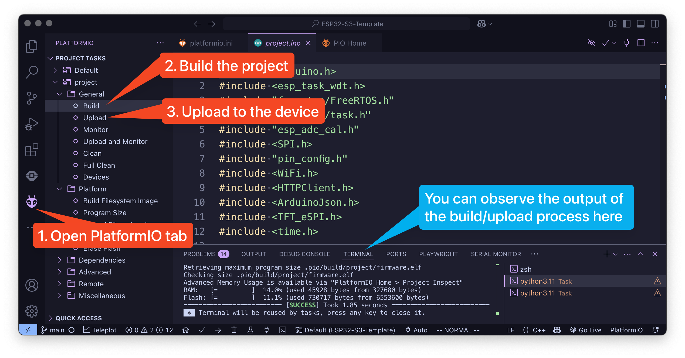

# ESP32-T4-S3-Template

Welcome to the lab using the ESP32-T4-S3 LilyGO!

This repository serves as a foundation for software engineering projects aimed at the ESP32 hardware.
This document will guide you through the setup process and help you prepare to work with your ESP32 hardware.

---

# How to get started

This project will work regardless of the operating system you use, and there are appended guides for each below.
Each of these tutorials is done on a fresh install of Visual Studio Code, which is the IDE you must use to complete this project.
Setting up and configuring the project will take multiple minutes, up to 15 min so be patient with the software.

## General

1. Install Visual Studio Code
   * Visit [Visual Studio Code's website](https://code.visualstudio.com/download) and download the latest version or use the package manager of your system.
   * Run `Visual Studio Code` and follow the steps.
2. Install the correct extension.
   * Head over to the extensions tab on your left.
   * Search for ["PlatformIO IDE"](https://marketplace.visualstudio.com/items?itemName=platformio.platformio-ide) and install it.

## Windows

3. Install the Clang compiler and C++ extension for Visual Studio Code.
   * (optional) If you want/need to use Windows Subsystem for Linux (WSL) have at the [documentation](https://code.visualstudio.com/docs/remote/wsl).

## Linux

3. Install the Clang compiler and C++ extension for Visual Studio Code.

4. Run the following command to add access to the `ttyACM0` port in order to avoid complications [1]
   * `sudo adduser $USER $(stat --format="%G" /dev/ttyACM0 )`

## MacOS

3. Run `git -v` in the Terminal app to check whether git and the macOS command line tools are installed. If the command line tools are not installed, a pop up will appear to install it.

## How to run the program

1. Open the locally cloned repository with Visual Studio Code
    * If the "Do you trust the authors of the files in this folder?" dialog appears, click on "Yes, I trust the authors"
2. Open up the file `project/project.ino`
3. Connect your ESP32 to your computer via a USB cable.
4. Build and upload the project to the device. See screenshot.

](./assets/screenshot.png)

---

## What to add where

Your code belongs in one file and one file only. The only place you should add, change, or remove things from is the [**project.ino**](project/project.ino) file in the `project` folder. Changing anything else might break the code and cause a lot of headaches for all involved parties.

## Areas of addition

You are meant to write a small application for the computer that retrieves the weather for a given location, and most of that code belongs in your own functions and the `void loop()` function at the bottom of the `project.ino` file.

## How to Connect to WiFi

The ESP32-T4-S3 LilyGO has a built-in WiFi module, which allows you to connect to the internet.
However, it does not work with eduroam, so you will need to connect to a different WiFi network.
To connect to WiFi, you need to provide your SSID and password in the [project/project.ino](./project/project.ino) file.


---

---

# LilyGo tutorial

From LilyGO [link](https://github.com/Xinyuan-LilyGO/LilyGo-AMOLED-Series)

## 1️⃣ PlatformIO Quick Start (Recommended)

1. Install [Visual Studio Code](https://code.visualstudio.com/) and [Python](https://www.python.org/)
2. Search for the `PlatformIO` plugin in the `VisualStudioCode` extension and install it.
3. After the installation is complete, you need to restart `VisualStudioCode`
4. After restarting `VisualStudioCode`, select `File` in the upper left corner of `VisualStudioCode` -> `Open Folder` -> select the `LilyGO AMOLED Series` directory
5. Wait for the installation of third-party dependent libraries to complete
6. Click on the `platformio.ini` file, and in the `platformio` column
7. Uncomment one of the lines `src_dir = xxxx` to make sure only one line works
8. Click the (✔) symbol in the lower left corner to compile
9. Connect the board to the computer USB
10. Click (→) to upload firmware
11. Click (plug symbol) to monitor serial output
12. If it cannot be written, or the USB device keeps flashing, please check the **FAQ** below


# 2️⃣ FAQ

1. The board uses USB as the JTAG upload port. When printing serial port information on USB_CDC_ON_BOOT configuration needs to be turned on.
   If the port cannot be found when uploading the program or the USB has been used for other functions, the port does not appear.
   Please enter the upload mode manually.

   1. Connect the board via the USB cable
   2. Press and hold the **BOOT** button , While still pressing the **BOOT** button
   3. Release the **RST** button
   4. Release the **BOOT** button
   5. The USB port should be fixed and will not flash again. You can click Upload.
   6. Press the **RST** button to exit download mode

2. If the above is invalid, burn the [binary file](./firmware/README.MD) to check whether the hardware is normal
3. **1.47 inches AMOLED(T-Display-AMOLED-Lite)** does not support hardware screen rotation function
4. If you use external power supply instead of USBC, please turn off the CDC option. This is because the board will wait for USB access when it starts.

   - For Arduino IDE users, it can be turned off in the options , Please note that turning off USB CDC will turn off Serial redirection to USBC. At this time, you will not see any Serial message output when opening the port from USBC, but output from GPIO43 and GPIO44.

   ```c
   Tools -> USB CDC On Boot -> Disable
   ```

   - For Platformio users, you can add the following compilation flags in the ini file

   ```c
   build_flags =
       ; Enable -DARDUINO_USB_CDC_ON_BOOT will start printing and wait for terminal access during startup
       ; -DARDUINO_USB_CDC_ON_BOOT=1

       ; Enable -UARDUINO_USB_CDC_ON_BOOT will turn off printing and will not block when using the battery
       -UARDUINO_USB_CDC_ON_BOOT
   ```
5. How to find the location of your own libraries, [please see here](https://support.arduino.cc/hc/en-us/articles/4415103213714-Find-sketches-libraries-board-cores-and-other-files-on-your-computer)
     - Windows: `C:\Users\{username}\Documents\Arduino`
     - macOS: `/Users/{username}/Documents/Arduino`
     - Linux: `/home/{username}/Arduino`